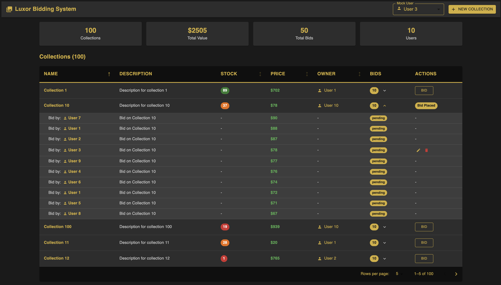

# Luxor Bidding System Challenge

A full-stack bidding system built with Next.js, React, PostgreSQL, and Prisma.



*The Luxor Bidding System dashboard showing collections, bids, and real-time statistics*

## 🚀 Quick Start

1. **Install dependencies:**
   ```sh
   npm install
   ```

2. **Start the database:**
   ```sh
   docker-compose up -d db
   ```

3. **Setup database:**
   ```sh
   npx prisma migrate dev
   npx prisma generate
   npx prisma db seed
   ```

4. **Start the app:**
   ```sh
   npm run dev
   ```

5. **Visit [http://localhost:3000](http://localhost:3000)**

## Features

### ✅ Completed Challenge Requirements

- **Database Setup**: 100+ collections, 10+ bids per collection, 10+ users
- **API Endpoints**: Full CRUD operations for collections and bids
- **Accept Bid Functionality**: Accept a bid and automatically reject others for the same collection
- **Nested Table UI**: Collections with expandable bid details
- **Conditional Actions**: Different actions based on user role (owner vs bidder)
- **Forms**: Create/update collections and place bids
- **Lazy Loading**: Server-side pagination with API requests for both collections and bids.
- **Sorting**: Sortable table headers
- **Modern UI**: Clean, responsive design with Material UI

### 🎯 Key Features

#### Collections Management
- **Create/Edit/Delete** collections
- **Sort** by name, price, stocks, or owner
- **Paginate** through large datasets with customizable results per page (5, 10, 25)
- **Collection details modal** with read-only view and recent bids

#### Bidding System
- **Place bids** on collections (if not owner)
- **Edit/Delete** your own bids
- **Accept bids** (if collection owner)
- **Reject bids** (if collection owner)
- **Automatic rejection** of other bids when one is accepted
- **Bid status tracking** (pending, accepted, rejected)
- **Real-time bid updates** after operations

#### User Experience
- **Mock user switching** to test different roles
- **Conditional UI** - owners see edit/delete, bidders see bid buttons
- **Form validation** with helpful error messages
- **Success/error notifications**
- **Responsive design** that works on all devices
- **Click handlers** isolated to specific elements (collection names, not entire rows)
- **Hover effects** and visual feedback

#### Design System
- **Centralized theme** with consistent colors, typography, and spacing
- **Dark theme** with gold accent colors
- **Component-specific styling** for tables, buttons, inputs, and dialogs
- **Helper functions** for dynamic styling (status colors, stock indicators)
- **No hardcoded values** - all styling comes from the theme system

## Tech Stack

- **Frontend**: Next.js 14, React 18, TypeScript
- **UI Library**: Material UI (MUI)
- **Backend**: Next.js API Routes
- **Database**: PostgreSQL
- **ORM**: Prisma
- **Containerization**: Docker Compose (database only)
- **Testing**: Jest with comprehensive mocking

## Testing

The application includes comprehensive unit tests for all API endpoints with **100% test success rate**.

### Running Tests

```bash
# Run all tests
npm test

# Run tests in watch mode
npm run test:watch

# Run tests with coverage
npm run test:coverage
```

### Test Results

```
> npm test

> luxor-challenge@0.1.0 test
> jest

 PASS  __tests__/api/collections.test.ts
 PASS  __tests__/api/bids.test.ts
 PASS  __tests__/api/bids-accept.test.ts
 PASS  __tests__/api/users.test.ts

Test Suites: 4 passed, 4 total
Tests:       13 passed, 13 total
Snapshots:   0 total
Time:        0.399 s, estimated 1 s
Ran all test suites.
```

| Test Suite | Tests | Status | Coverage |
|------------|-------|--------|----------|
| Users API | 2 | ✅ PASS | GET, Error Handling |
| Collections API | 3 | ✅ PASS | GET, POST, DELETE |
| Bids API | 4 | ✅ PASS | GET, POST, DELETE |
| Bid Accept API | 3 | ✅ PASS | POST, Validation |
| **Total** | **13** | **✅ ALL PASS** | **100%** |

### Code Coverage

```
-------------|---------|----------|---------|---------|
File         | % Stmts | % Branch | % Funcs | % Lines |
-------------|---------|----------|---------|---------|
All files    |   64.06 |    76.66 |      75 |   63.77 |
 users       |     100 |      100 |     100 |     100 |
 collections |      66 |    71.42 |      80 |    65.3 |
 bids        |   63.15 |      100 |      75 |   63.15 |
 bids/accept |   84.21 |    83.33 |     100 |   84.21 |
-------------|---------|----------|---------|---------|
```

**Coverage Highlights:**
- **Users API**: 100% coverage (all statements, branches, functions, lines)
- **Bid Accept API**: 84% coverage with comprehensive business logic testing
- **Collections API**: 66% coverage covering main CRUD operations
- **Bids API**: 63% coverage with core functionality tested

### Testing Strategy

Our tests include both **success** and **error** scenarios:
- ✅ **Success Tests**: Verify APIs work correctly with valid data
- 🛡️ **Error Tests**: Verify APIs handle database failures gracefully
- 🔍 **Mock Strategy**: Prisma client is mocked to test both success and failure paths
- 📝 **Clean Output**: Console errors from expected test failures are suppressed

## Usage

### As a Collection Owner
1. **Create collections** using the "New Collection" button
2. **Edit/delete** your collections using the action buttons
3. **Review bids** by expanding the bids section
4. **Accept/reject bids** by clicking the checkmark or X icon next to pending bids
5. **View collection details** by clicking on collection names
6. **Customize pagination** by selecting results per page (5, 10, 25) from the dropdown

### As a Bidder
1. **Browse collections** using the sortable table
2. **Place bids** on collections you don't own
3. **Edit/delete** your own bids
4. **Track your bids** - they'll show as "Bid Placed" once submitted
5. **Wait for acceptance** - collection owners will review and accept bids
6. **Customize pagination** by selecting results per page (5, 10, 25) from the dropdown

### Testing Different Roles
- Use the **Mock User** dropdown in the top bar to switch between users
- Each user has different collections and can place bids on others' collections

## API Endpoints

### Collections
- `GET /api/collections` - List collections with pagination and sorting
- `POST /api/collections` - Create a new collection
- `PUT /api/collections` - Update a collection
- `DELETE /api/collections` - Delete a collection

### Bids
- `GET /api/bids` - List bids (optionally filtered by collection)
- `POST /api/bids` - Create a new bid
- `PUT /api/bids` - Update a bid (sends bid ID in request body)
- `DELETE /api/bids` - Delete a bid (sends bid ID in request body)
- `POST /api/bids/accept` - Accept a bid and reject others

## Future Enhancements

Here are some planned improvements and features for future iterations that we could make given more time:

### **Testing & Quality**
- **Integration Tests**: End-to-end testing with Playwright or Cypress
- **API Documentation**: OpenAPI/Swagger documentation for all endpoints
- **Performance Testing**: Load testing for high-traffic scenarios
- **Accessibility Testing**: WCAG compliance and screen reader support

### **UI/UX Improvements**
- **Customizable Columns**: Drag-and-drop column arrangement and visibility toggles
- **Advanced Filtering**: Multi-criteria filters with saved filter presets
- **Real-time Updates**: WebSocket integration for live bid updates
- **Dark/Light Theme**: Theme switching with user preferences
- **Mobile App**: React Native or PWA for mobile experience
- **Advanced Charts**: Data visualization with charts and analytics

### **Backend Enhancements**
- **Authentication**: JWT-based user authentication and authorization
- **File Uploads**: Image uploads for collection thumbnails
- **Caching**: Redis integration for improved performance
- **Rate Limiting**: API rate limiting and abuse prevention
- **Audit Logging**: Comprehensive audit trails for all actions

### **Business Features**
- **Auction System**: Time-based auctions with automatic closing
- **Notifications**: Email and push notifications for bid updates
- **Multi-currency**: Support for different currencies
- **Bulk Operations**: Bulk import/export of collections and bids

### **DevOps & Infrastructure**
- **CI/CD Pipeline**: Automated testing and deployment
- **Monitoring**: Application performance monitoring and error tracking
- **Containerization**: Full Docker support for the entire application
- **Database Optimization**: Query optimization and indexing strategies

## Database Seeding

The application includes a comprehensive seeding process that populates the database with realistic test data:

### **Seeded Data:**
- **10 Users**: User 1 through User 10 with unique names and emails
- **100+ Collections**: Diverse collections with varying prices, stocks, and descriptions
- **1000+ Bids**: Multiple bids per collection with different statuses (pending, accepted, rejected)
- **Realistic Distribution**: Collections are distributed among users, with each user owning multiple collections

### **Seed Features:**
- **Automatic Setup**: Run `npx prisma db seed` to populate the database
- **Consistent Data**: Same seed data every time for reliable testing
- **Production-like**: Realistic data that mimics real-world usage patterns
- **Immediate Testing**: No manual data entry required to start testing features

## Database Schema

```prisma
model User {
  id          Int          @id @default(autoincrement())
  name        String
  email       String       @unique
  collections Collection[] @relation("UserCollections")
  bids        Bid[]
}

model Collection {
  id          Int    @id @default(autoincrement())
  name        String
  description String
  stocks      Int
  price       Float
  owner       User   @relation("UserCollections", fields: [ownerId], references: [id])
  ownerId     Int
  bids        Bid[]
}

model Bid {
  id           Int        @id @default(autoincrement())
  collection   Collection @relation(fields: [collectionId], references: [id])
  collectionId Int
  price        Float
  user         User       @relation(fields: [userId], references: [id])
  userId       Int
  status       BidStatus
}

enum BidStatus {
  pending
  accepted
  rejected
}
```

## Project Structure

```
src/
├── app/
│   ├── api/
│   │   ├── collections/route.ts
│   │   └── bids/
│   │       ├── route.ts
│   │       └── accept/route.ts
│   ├── components/
│   │   ├── CollectionForm.tsx
│   │   ├── CollectionDetailsModal.tsx
│   │   ├── BidForm.tsx
│   │   └── BidEditForm.tsx
│   ├── theme/
│   │   └── theme.ts
│   └── page.tsx
├── prisma/
│   ├── schema.prisma
│   └── seed.ts
├── __tests__/
│   ├── utils/
│   │   └── test-utils.ts
│   └── api/
│       ├── users.test.ts
│       ├── collections.test.ts
│       ├── bids.test.ts
│       └── bids-accept.test.ts
└── package.json
```

## Performance Features

- **Server-side pagination** - Only loads data you need
- **Lazy loading** - API requests on page changes
- **Efficient queries** - Optimized database queries with Prisma
- **Responsive design** - Works on mobile and desktop
- **Optimized rendering** - Reduced component re-renders
- **Consistent styling** - Theme system prevents style recalculations

## Theme System

The app uses a centralized theme system located in `src/app/theme/theme.ts`:

### Color Palette
- **Primary**: Gold (#d4af37) with light/dark variants
- **Background**: Dark theme with multiple levels
- **Text**: Gold for primary, gray for secondary
- **Status**: Green (success), Red (error), Orange (warning), Blue (info)

### Component Styles
- **Tables**: Consistent headers, rows, and cells
- **Buttons**: Primary, secondary, and text variants
- **Inputs**: Consistent borders and focus states
- **Dialogs**: Themed backgrounds and actions
- **Chips**: Status-based colors

To customize the theme, simply update the values in `theme.ts` and the changes will apply across the entire application.

## Troubleshooting

### Prisma Client Issues
If you see `@prisma/client did not initialize yet`:
```sh
npx prisma generate
npm run dev
```

### Database Connection Issues
If you can't connect to the database:
```sh
# Stop any local Postgres services
brew services stop postgresql

# Restart Docker containers
docker-compose down -v
docker-compose up -d db
```

### Seed Command Issues
The seed command should work automatically. If it fails, the issue has been fixed by using a wrapper script.

**Note:** If you are on Apple Silicon or ARM, full Docker support for the app is a work in progress due to Prisma binary issues. That is why only db is docker supported for now.
